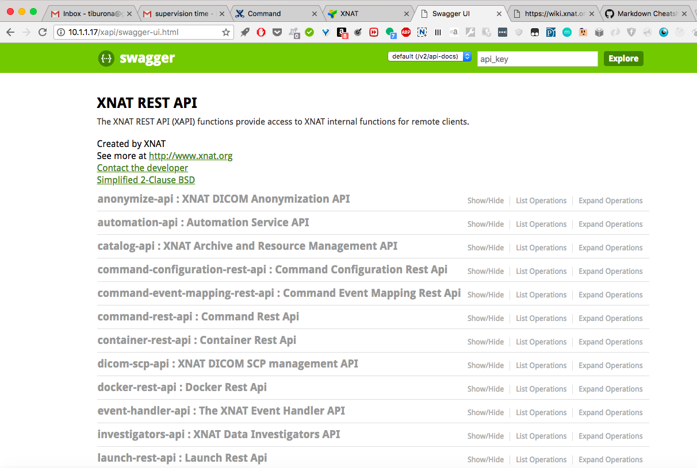

# A tutorial on getting XNAT’s container service up and running and writing commands

This tutorial assumes you have a working XNAT instance. You must have administrator priveleges on your XNAT instance to use the Container Service.  If you are not sure how to set up an XNAT instance and would like a quick way to get up and running.  

## Installing the Container Service plugin.

Download the .jar file of the “Latest Release” on this page to `<xnat-home>/plugins` and restart the tomcat server.

In more detail: 

1. Nagivate to the plugins directory under your XNAT home directory.

   If you are using the Vagrant VM standard setup described above, this is how you get to your home directory on the virtual machine (and give yourself write permission):

   ```
   cd <xnat-installation-directory>xnat-vagrant/configs/xnat-release
   vagrant ssh
   sudo -i
   ```
   Now you should have a `root@xnat-release` command prompt.  Finally
   ```
   cd /data/xnat/home/plugins
   ```

   (or cd to wherever `<xnat-home>/plugins` is on your XNAT instance.)

2. Download the "Latest Release" from [this page](https://github.com/NrgXnat/container-service/releases).  As of this writing (5/30/18) the link to the latest release was [here](https://github.com/NrgXnat/container-service/releases/download/1.5.1/containers-1.5.1-fat.jar).
In your XNAT home directory, you can download it with:
```wget https://github.com/NrgXnat/container-service/releases/download/1.5.1/containers-1.5.1-fat.jar``` (or, if you are reading this IN THE FUTURE, the new "latest release" that has superceded 1.5.1).

3. Restart tomcat

   `service tomcat7 restart`

   Now, under Administer -> Plugin Settings in the XNAT menu you should see the Container Service pages. 

## Installing Images for the Container Service  

The Container Service currently uses Docker.  That means that your containers will be based on Docker Images.  The first step in running a process via the container service is to pull or create a Docker Image.  Your Docker Images and Containers do not have to live on the same machine as your XNAT instance.  However, configuring the Container Service to listen to a remote server for new Docker Images is beyond the current scope of this tutorial; we will pull Docker Images to the machine that hosts our XNAT instance.  

If you have not already, create an account on Docker.com.

Then, from the command prompt of your XNAT machine (if you are using the Vagrant VM, from the root@xnat-release command prompt)

```
docker login
```
and sign in with your credentials.  

You can build your own Docker image, but you can also find many publically available images at [Docker Hub](https://hub.docker.com/).  Sign in with the same credentials you used to log in to Docker on your XNAT server.  This tutorial will use the [brainlife/fsl image](https://hub.docker.com/r/brainlife/fsl/), since we are going to move on to running FSL processes. To pull this image to your machine, 

```
docker pull brainlife/fsl
```

If instead you needed to run another program, like SPM, you could search Docker Hub for an image with SPM installed, or build your own image.  

The image should begin downloading.  When it completes, if you navigate to Administer -> Plugin Settings -> Images & Commands, you should see listed `brainlife/fsl:latest`. 

## Setting up a first command

XNAT requires information about what command-line instruction to send to the Docker container, what inputs that process expects, and how to process any outputs, if outputs are expected.  We give this information to XNAT in a JSON object called the command.  We'll start with the "Hello, World" of commands, adapted from the [official documentation](https://wiki.xnat.org/display/CS/Command).  

Navigate to Administer -> Plugin Settings -> Images and Commands.  Press the button `Add New Command` next to the listing for the brainlife/fsl image.  Copy and paste the following JSON object into the box that pops up (you can paste over the braces that are there by default), and click `Save Command`.

```
{
    "name": "hello-world",
    "description": "Prints a string to stdout",
    "type": "docker",
    "image": "brainlife/fsl:latest",
    "command-line": "echo #my_cool_input#",
    "inputs": [
        {
            "name": "my_cool_input",
            "description": "The string that will be printed",
            "type": "string",
            "default-value": "Hello world"
        }
    ]
}
```

The entry for `command-line` in the JSON object is, unusually intuitively for this context, the code that will actually be executed at the command prompt of your docker container.  However, the string in hash marks won't be executed verbatim.  Instead, it will be matched with an input replacement key from one of the members of the list of inputs (the array that's the value for the key `inputs`).  You can specify an input replacement key, but by default every input has an input replacement key `#<input-name>#`. So `"echo #my_cool_input#"` will actually send to the command line the instruction to echo whatever the value of the input `my_cool_input` is.  We can see the default value is set to "Hello world", though we will see how to launch a container with other values in the next section.  

## Launching a container

Commands in XNAT are launched via the REST API.  A REST API is a set of conventions wherein a program (here, the container service) can send requests to a application (here, the XNAT instance) via a URI (route), and the program responds.  In this case, all the requests we will send will be POST requests.  That means we will be sending some information along with the URI which gives the the application additional information.  

If you are familiar with REST, you know that there are lots of ways to make REST requests: curl, Postman,and the Python requests library are all options that could make sense in this context.  In this tutorial, we will be using the Swagger web interface to the API provided by XNAT. The subset of XNAT's API that you access with Swagger are the routes that trigger internal XNAT functions.  All these routes start with `/xapi`.  The URL of the Swagger interface is `http://<xnat-instance-url>/xapi/swagger-ui.html`. If you are running the Vagrant XNAT instance locally that URL is (http://10.1.1.17/xapi/swagger-ui.html).  



We are going to launch a container, so we scroll down to `launch-rest-api` 


## Glossary

 

Docker Container: a specific instance of a machine, derived from a Docker Image.  Docker containers can run processes.

Docker Hub: a repository with pre-built Docker Images.

Docker Image: an image is a snapshot of a machine that has the capacity to run processes.  It form the basis for a Docker container. 

Command: a JSON file that gives XNAT the information it needs run processes in a Docker Container. 

Input Replacement Key: a string in the command-line value of the command that will be matched with, and replaced by, a string from an input provided when the container is launched.

REST API: a set of conventions wherein a program can send requests to a application via a URI to either get information from the application's back end, or to provide data to the application.

Swagger: a web interface to XNAT's API.


