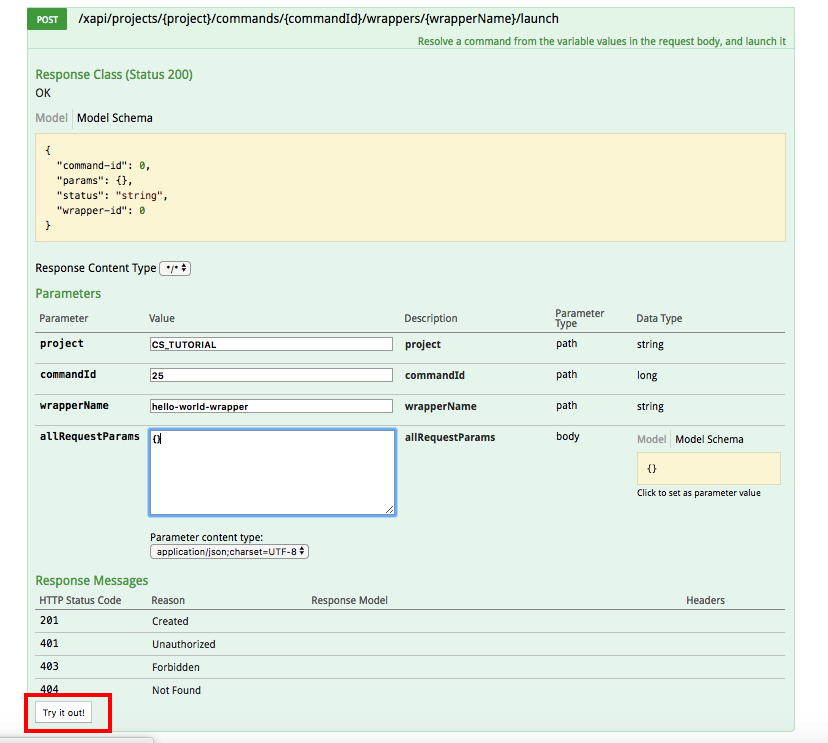

[Home](./tutorial.md)   [Glossary](./tutorial.md#glossary)

## Part 1. Installing the Container Service and Executing a Command: Hello, World. 

### Table of Contents
  [What This Tutorial Covers](#what-this-tutorial-covers)  
  [What You Need Before You Begin](#what-you-need-before-you-begin)  
  [Installing the Container Service Plugin](#installing-the-container-service-plugin)  
  [Installing Images for the Container Service](#installing-images-for-the-container-service)  
  [Setting Up a First Command](#setting-up-a-first-command)  
  [Interacting With the REST API](#interaction-with-the-rest-api)  
  [Running Our Hello World Command](#running-our-hello-world-command)  
  [Investigating the Command History](#investigating-the-command-history)  
  [Changing the Input](#changing-the-input)    
  [Error Logging](#error-logging)   

### What This Tutorial Covers

This tutorial is a walk-through from installing the Container Service plugin through writing commands that take multiple images as inputs and mount multiple outputs in XNAT, endeavoring to explain enough about XNAT CS functionality to enable the person who completes the tutorial to write their own commands for their own needs.  It assumes some basic familiarity with command line interfaces, but not more than that.  

### What You Need Before You Begin

This tutorial assumes you have a working XNAT instance. You must have administrator privileges on your XNAT instance to use the Container Service.  If you are not sure how to set up an XNAT instance and would like a quick way to get up and running, the one-line XNAT VM setup described [here](https://wiki.xnat.org/display/XNAT17/Running+XNAT+in+a+Vagrant+Virtual+Machine) is a quick way to get started.  If you've installed the prerequisites and executed that line of code, your XNAT web interface should be available in your browser at 10.1.1.17, login: admin and password: admin.

### Installing the Container Service Plugin

Download the .jar file of the “Latest Release” on this page to `<xnat-home>/plugins` and restart the tomcat server.

In more detail: 

1. Nagivate to the plugins directory under your XNAT home directory.

   If you are using the Vagrant VM standard setup described above, this is how you get to your home directory on the virtual machine (and give yourself write permission):

   ```
   cd <xnat-installation-directory>/xnat-vagrant/configs/xnat-release
   vagrant ssh
   sudo -i
   ```

   Now you should have a `root@xnat-release` command prompt.  Finally

   ```
   cd /data/xnat/home/plugins
   ```

   (or cd to wherever `<xnat-home>/plugins` is on your XNAT instance.)

2. Download the "Latest Release" from [this page](https://github.com/NrgXnat/container-service/releases).  As of this writing (5/30/18) the link to the latest release was [here](https://github.com/NrgXnat/container-service/releases/download/1.5.1/containers-1.5.1-fat.jar).
In your XNAT home directory, you can download it with:
```wget https://github.com/NrgXnat/container-service/releases/download/1.5.1/containers-1.5.1-fat.jar``` (or, if you are reading this IN THE FUTURE, the new "latest release" that has superceded 1.5.1).

3. Restart tomcat

   `service tomcat7 restart`

   Now, under Administer -> Plugin Settings in the XNAT menu you should see the Container Service pages. 

### Installing Images for the Container Service  

The Container Service currently uses Docker.  That means that your containers will be based on Docker images.  The first step in running a process via the container service is to pull or create a Docker image.  Your Docker images and containers do not have to live on the same machine as your XNAT instance.  However, configuring the container service to listen to a remote server for new Docker images is beyond the current scope of this tutorial; we will pull Docker images to the machine that hosts our XNAT instance.  

If you have not already, create an account on Docker.com.

Then, from the command prompt of your XNAT machine (if you are using the Vagrant VM, from the root@xnat-release command prompt)

```
docker login
```
and sign in with your credentials.  

You can build your own Docker image, but you can also find many publically available images at [Docker Hub](https://hub.docker.com/).  Sign in with the same credentials you used to log in to Docker on your XNAT server.  This tutorial will first use the [xnat/dcm2niix image](https://hub.docker.com/r/xnat/dcm2niix/), and then later move to an image with FSL installed. To pull this the dcm2niix image to your machine, 

```
docker pull xnat/dcm2niix
```

The image should begin downloading.  When it completes, if you navigate to **Administer -> Plugin Settings -> Images & Commands**, you should see listed `xnat/dcm2niix:latest`. 


### Setting Up a First Command

XNAT requires information about what command-line instruction to send to the Docker container, what inputs that process expects, and how to process any outputs, if outputs are expected.  We give this information to XNAT in a JSON object called the command.  We'll start with the "Hello, World" of commands, adapted from the [official documentation](https://wiki.xnat.org/display/CS/Command). This command allows us to launch a container that will print "Hello world" (or anything else) to standard out.

Navigate to **Administer -> Plugin Settings -> Images and Commands**.  Press the button `Add New Command` next to the listing for the xnat/dcm2niix image. 


 Copy and paste the following JSON object into the box that pops up (you can paste over the braces that are there by default), and click `Save Command`.

```
{
    "name": "hello-world",
    "description": "Prints a string to stdout",
    "type": "docker",
    "image": "brainlife/fsl:latest",
    "command-line": "echo #my_cool_input#",
    "inputs": [
        {
            "name": "my_cool_input",
            "description": "The string that will be printed",
            "type": "string",
            "default-value": "Hello world"
        }
    ],
    "xnat": [
      {
        "name": "hello-world-wrapper",
        "description": "echo Hello world"}
    ]
}
```

After you've saved your command, you can see it available under the list of commands for your image.

  

The entry for `command-line` in the JSON object is, unusually intuitively for this context, the code that will actually be executed at the command prompt of your docker container.  However, the string in hash marks won't be executed verbatim.  Instead, it will be matched with an input replacement key from one of the members of the list of inputs (the array that's the value for the key `inputs`).  You can specify an input replacement key, but by default every input has an input replacement key `#<input-name>#`. So `"echo #my_cool_input#"` will actually send to the command line the instruction to echo whatever the value of the input `my_cool_input` is.  We can see the default value is set to "Hello world", though we will see how to launch a container with other values in the next section.

Another element we'll see more of is the wrapper. That's the object you see in the list after the "xnat" key. A wrapper contains information that helps XNAT use its internal information to provide files and strings for inputs, and to process outputs.  This information would not available to the docker container, which only knows what it got from its image or what it learns when it's run.  There's no internal XNAT information to call on in this simple example, but we need a wrapper name or ID in order to launch a container, and the wrapper description is necessary so that we can more easily look at our output in the XNAT web interface.[*](#asterisk)

### Interacting With the REST API

Commands in XNAT are launched via the REST API.  A REST API is a set of conventions wherein a program (here, the container service) can send requests to a application (here, the XNAT instance) via a URI (route), and the program responds.  All the requests we send to launch containers will be POST requests.  That means we will be sending some information along with the URI which gives the the application additional information. In this tutorial, we will also make one GET request, which requests information from the application.  

If you are familiar with REST, you know that there are lots of ways to make REST requests: cURL, Postman,and the Python requests library are all options that could make sense in this context. In this tutorial, we will be mostly be using the Swagger web interface to the API provided by XNAT.  The subset of XNAT's API that you access with Swagger are the routes that trigger internal XNAT functions.  All these routes start with `/xapi`.  The URL of the Swagger user interface is `http://<xnat-instance-url>/xapi/swagger-ui.html`. If you are running the Vagrant XNAT instance locally that URL is (http://10.1.1.17/xapi/swagger-ui.html).  


The Swagger interface also acts as a directory of the routes available to us. (Another source of documentation is available [here](https://wiki.xnat.org/display/CS/Container+Service+API).)  We are going to launch a container, so we scroll down to `launch-rest-api` and click on it to expand it.  We can see now why we need a wrapper.  All the routes require a wrapper name or a wrapper id. For example, 

`POST /xapi/projects/{project}/wrapper/{wrapperId}/launch`

has two variables, indicated by the placeholders in braces, that would need to be supplied by us, project and wrapperId. 

Another small complexity is that, at least in the current version of XNAT, 1.7.4.1, you'll notice that some of the routes have the note "Does not work properly in Swagger UI."  All the routes that *do* work through the Swagger UI require a project. We'll work around this by supplying a project, even if it shouldn't be strickly necessary.  It's also possible that if you are using 1.7.4.1, you'll find that a different set of routes work then the ones assumed to work in this tutorial (see [here](https://groups.google.com/forum/#!topic/xnat_discussion/ePwqyr3OmLs) for a discussion of why.)

### Running Our Hello World Command

We'll make a project.  Go to New -> Project.

Fill out the values for Project Title, Running Title, and Project ID as follows:

Project Title: Container Service Tutorial Project
Running Title: CS_TUTORIAL
Project ID: CS_TUTORIAL


Now that we have a project id, we can use the following route to launch our command.  

`POST /xapi/projects/{project}/commands/{commandId}/wrappers/{wrapperName}/launch`

Scroll down to this route on the Swagger UI page and click on the route to expand it.  


We need to supply three pieces of information: the project ID, the command ID, and the wrapper name. We just gave our project an ID: CS_TUTORIAL.  

You can get the command ID from in XNAT's web interface.  Once you've saved the command, open it back up again.  You'll see the command ID in the upper left corner. (Your command ID will likely be different from the one pictured.)


The wrapper name we assigned in the command in the Setting Up a First Command Section: hello-world-wrapper

This POST request is unusual in that it does not need any parameters in the request body.  Right now we are only printing the default value of the input to standard out, so we don't need to pass it any further information.  We can use an empty object as our request body.

We can assign these values in the Swagger UI and click Try It Out! to launch our container.



You should get a response code of 201, and a response body that looks something like this:

```
{
  "status": "success",
  "params": {},
  "command-id": 25,
  "wrapper-id": 34,
  "container-id": "512da6dd3efa5620f437a52c367ae3cff89c741d17d8794a35acadbc29507a89",
  "type": "container"
}
```

(Troubleshooting note: did you get a bunch of HTML in your response body instead of a JSON object?  It may be because your authentication timed out in XNAT.  Make sure you are logged in to XNAT in the same browser as your Swagger UI window.)

This JSON object tells us that our API request was successful and that we launched a container.  But how do we get information about whether it worked?

### Investigating the Command History

Navigate to Administer -> Plugin Settings -> Command History

You should see your newly executed command.  Click on the command description to get more information about what happened at execution time.  


You should see a table that looks something like this:

 Key	| Value 
 --- | ----- 
 id	| 83 |
command-id | 26
status	| Complete
status-time	 | 1526395805313
wrapper-id	| 35
container-id	| 7c76f2a366fe81fd67ac28bfefab7aa08fc35969e119b18277137d1472b8344b
workflow-id	 | null
user-id	| admin
swarm	| false
service-id	| null
task-id	| null
node-id	| null
docker-image	| xnat/dcm2niix:latest
command-line	| echo Hello world
override-entrypoint	| null
working-directory	| null
subtype	| docker
parent-source-object-name	| null
env	| {"XNAT_USER":"51d0ddc5-e027-4177-bed9-74577507d9db","XNAT_HOST":"http://10.1.1.17","XNAT_PASS":"******"}
ports	| {}
mounts	
inputs	| {"id":440,"type":"command","name":"my_cool_input","value":"Hello world"}
outputs	
history	| {"id":396,"status":"Created","entity-type":"user","entity-id":"admin","time-recorded":1526395800062}  {"id":397,"status":"create","entity-type":"event","time-recorded":1526395805207,"external-timestamp":"1526395800057904581"} {"id":398,"status":"start","entity-type":"event","time-recorded":1526395805229,"external-timestamp":"1526395800335165881"} {"id":399,"status":"die","entity-type":"event","time-recorded":1526395805251,"external-timestamp":"1526395800418540450","exitCode":"0"}
log-paths	| /data/xnat/archive/CONTAINER_EXEC/20180515_145005/LOGS/stdout.log
reserve-memory	| null
limit-memory	| null
limit-cpu	| null

Of particular interest are the entries `command-line` which tells us what our container actually ran at its shell prompt, our `inputs`, which we currently have one of, with the name `my-cool-input` and the value "Hello world", and our `log-paths`, which is where on our XNAT server that we'll find anything that got printed to our container's standard out.  The web interface also makes that information available; click on View StdOut.log to see what we printed.  


It should say "Hello world".  

### Changing the Input

What if we wanted to print something else to standard out.  We don't have to change our command.  Instead, because our command knows that it takes an input, we can send that input with our POST request as a value in the request body.  Try typing making your request again, but this time entering `{"my_cool_input":"Hello Pluto"}` in the allRequestParams box in the Swagger UI.  Now when you go to Command History -> description for your most execution -> View StdOut.log, you'll see "Hello Pluto".

(XNAT troubleshooting: occasionally Command History decides not to display.  I find that creating and deleting a command from the Images and Commands display can make it show up again.)

If you want to do an exercise to make sure you've mastered XNAT commands thus far, before you move on, see if you can write a command that takes a directory name as an input and then uses `ls` to print the contents of that directory to standard out.

### Error Logging

If you did the exercise in the previous section and accidentally or on purpose you passed the command a directory that didn't exist, you may have already seen that some command executions generate a StdErr.log, which is accessible from a button in the same location as StdOut.log.  If you haven't yet seen that, take this line

`"command-line": "echo #my_cool_input#",`

ahd change it to

`"command-line": "ls foo",`

Now you should see the StdErr.log reads `ls: cannot access foo: No such file or directory`.

(XNAT troubleshooting: sometimes XNAT gets itself into a state where it can't save edits to a command.  Sometimes it appears to spontaneously reorder elements of a command you've written, which in some cases can damage functionality.  When that happens you can copy your command, delete the existing command, and add a new command with your edits.) 

<a name="asterisk">*</a> The example given in the documentation does not include an XNAT wrapper, but in practice I don't know how that example can be launched. All current routes in the REST API require a wrapper name or wrapper id. 
