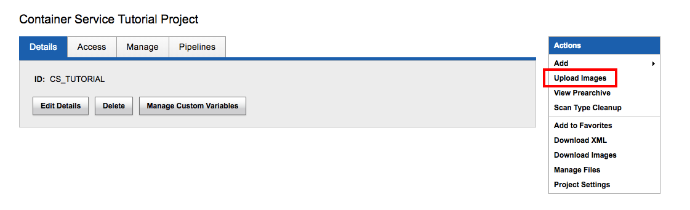
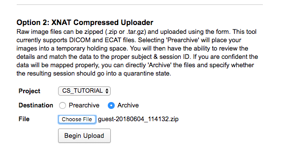
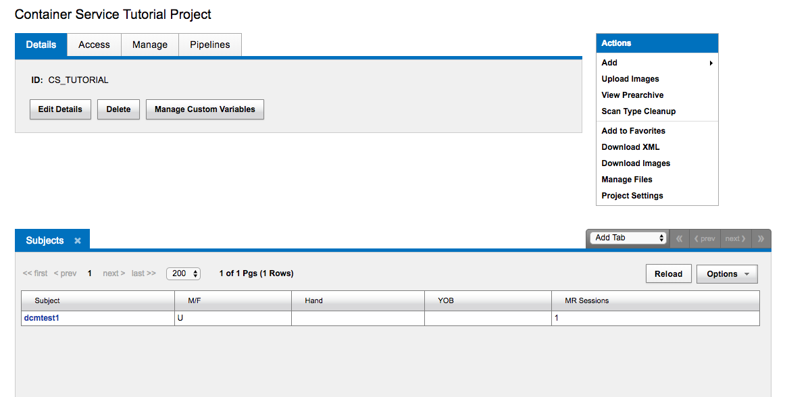
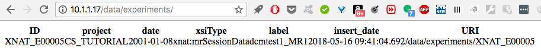
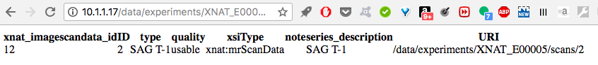
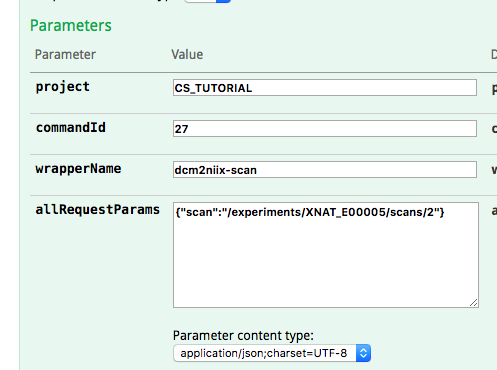
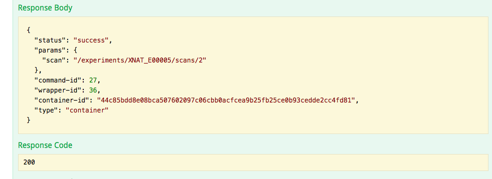
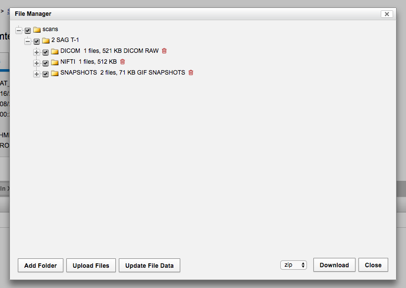
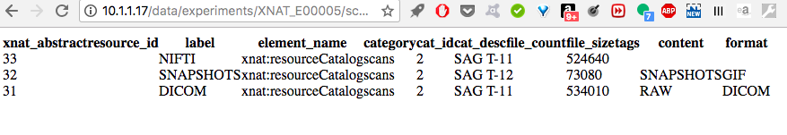
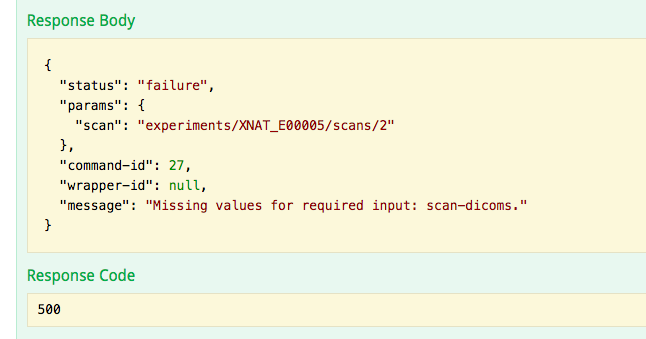

[Home](./tutorial.md)

## Part 2. Manipulating Data from XNAT: dcm2niix

### Table of Contents

[A First Command With Imaging Inputs](#a-first-command-with-imaging-inputs)  
[Mounts, Inputs, and Outputs](#mounts-inputs-and-outputs)  
[A Simile Involving a Wizard You Can Skip If It's Confusing](#a-simile-involving-a-wizard-you-can-skip-if-its-confusing)  
[A Closer Look at Mounts](#a-closer-look-at-mounts)  
[XNAT's Data Organization](#xnats-data-organization)  
[A Closer Look at Wrapper Inputs](#a-closer-look-at-wrapper-inputs)  
[Output Handling](#output-handling)  
[One Common Error](#one-common-error)

### A First Command With Imaging Inputs

We are on XNAT to do neuroimaging, are we not?  The next step in getting to command mastery is to execute a command that takes neuroimaging inputs and generates outputs.  The XNAT team has already written a command to execute [dcm2niix](https://github.com/rordenlab/dcm2niix), a popular utility to convert DICOM files to NIFTI files, and it was for that reason that we pulled the dcm2niix image.  

Here's the command (you can also find it [here](https://github.com/NrgXnat/docker-images/blob/master/dcm2niix/command.json)):

```
{
    "name": "dcm2niix",
    "description": "Runs dcm2niix",
    "info-url": "https://github.com/rordenlab/dcm2niix",
    "version": "1.4",
    "schema-version": "1.0",
    "type": "docker",
    "image": "xnat/dcm2niix",
    "command-line": "dcm2niix [BIDS] [OTHER_OPTIONS] -o /output /input",
    "mounts": [
        {
            "name": "dicom-in",
            "writable": "false",
            "path": "/input"
        },
        {
            "name": "nifti-out",
            "writable": "true",
            "path": "/output"
        }
    ],
    "inputs": [
        {
            "name": "bids",
            "description": "Create BIDS metadata file",
            "type": "boolean",
            "required": false,
            "default-value": false,
            "replacement-key": "[BIDS]",
            "command-line-flag": "-b",
            "true-value": "y",
            "false-value": "n"
        },
        {
            "name": "other-options",
            "description": "Other command-line flags to pass to dcm2niix",
            "type": "string",
            "required": false,
            "replacement-key": "[OTHER_OPTIONS]"
        }
    ],
    "outputs": [
        {
            "name": "nifti",
            "description": "The nifti files",
            "mount": "nifti-out",
            "required": "true"
        }
    ],
    "xnat": [
        {
            "name": "dcm2niix-scan",
            "description": "Run dcm2niix on a Scan",
            "contexts": ["xnat:imageScanData"],
            "external-inputs": [
                {
                    "name": "scan",
                    "description": "Input scan",
                    "type": "Scan",
                    "required": true,
                    "matcher": "'DICOM' in @.resources[*].label"
                }
            ],
            "derived-inputs": [
                {
                    "name": "scan-dicoms",
                    "description": "The dicom resource on the scan",
                    "type": "Resource",
                    "derived-from-wrapper-input": "scan",
                    "provides-files-for-command-mount": "dicom-in",
                    "matcher": "@.label == 'DICOM'"
                }
            ],
            "output-handlers": [
                {
                    "name": "nifti-resource",
                    "accepts-command-output": "nifti",
                    "as-a-child-of-wrapper-input": "scan",
                    "type": "Resource",
                    "label": "NIFTI"
                }
            ]
        }
    ]
}
``` 

Add this command to the dcm2niix image under Images & Commands, [just like you did](./tutorial_part1.md#setting-up-a-first-command) for the Hello, World command.

### Mounts, Inputs, and Outputs

Some things to pay attention to:

1. In our `command-line` entry, there are now some values in brackets, "[BIDS]" and "[OPTIONS]".  Those are input replacement keys.  This command doesn't use the default (the name of the inputs surrounded by hashtags) for a replacement key, but instead specifies a custom replacement key.  Under `inputs`, we now have an array of two items, a boolean specifying true or false for BIDS, and a string for any other options we want to pass to dcm2niix.

2. We now have mounts for both input and outpout.  A mount is a location in a file system where external storage can be accessed.  In this case, the file system is our container.  In order for our container to operate on input files from XNAT, they must be mounted within the container.  Similarly, the output files must have a defined location in the container directory tree so that XNAT can access them and move them into its own directory structure.

3. Under the `xnat` key we now have two different kinds of inputs, so there are now three kinds of inputs a command takes.

* The first kind is the input we've already seen, command input: a value, either a string, a Boolean, or a number, that goes directly on the command line, replacing a replacement key.  You list these inputs under the `input` key on the top level of the JSON object.  

* The second is external input.  This is the path to an XNAT object.  This path is supplied in the request body when the program (i.e., you, using Swagger or any other client) makes a request. External inputs go in an array under the `external-inputs` key underneath the `xnat` key. 

* The third is derived input.  Derived inputs are XNAT objects or strings that you get from other XNAT objects by referencing their properties or their children.  We'll go into more detail about this in a bit.  Since really all the container knows about are what it executes from the command line and what files it has mounted, your derived input needs at some point to be mounted or translated into the first kind of input to be used.  This kind of input is stored in an array under the `derived-inputs` key underneath the `xnat` key.  External and derived inputs together are also called wrapper inputs.  The way the developers think about it, the information under the `xnat` key, that is, the wrapper, wraps around the container and allows it to communicate with XNAT. 

4. We also now have outputs.  After the container executes whatever process is necessary, it must copy output from the container directory tree to the XNAT directory tree.  The wrapper provides the information about how to do that. 

### A Simile Involving a Wizard You Can Skip If It's Confusing

 It's like the container is an old wizard in a cave, and the command is an emmissary who comes bearing delicious fruit that has been enchanted to look like useless lumps of coal. (The fruits are our image files.)  But the lumps of coal are covered in a piece of paper, the wrapper, on which is a spell that allows the wizard to break the enchantment and unlock their true fruit nature.  Similarly, the container wizard is so grateful to the command emissary for bringing her fruit that she offers the emissary the pits, wrapped in the same paper.  When the emissary recites the second spell on the paper the pits turn into gold coins.

 ### A Closer Look at Mounts

 To make sure we understand what's happening with our mounts, let's look at again at the command and this page from the [dcm2niix readme](https://github.com/rordenlab/dcm2niix).  


 > The minimal command line call would be dcm2niix /path/to/dicom/folder. However, you may want to   invoke additional options, for example the call dcm2niix -z y -f %p_%t_%s -o /path/ouput /path/to/dicom/folder will save data as gzip compressed, with the filename based on the protocol name (%p) acquisition time (%t) and DICOM series number (%s), with all files saved to the folder "output". For more help see help: dcm2niix -h.

So dcm2niix takes two directories in the command line.

```
  "command-line": "dcm2niix [BIDS] [OTHER_OPTIONS] -o /output /input",
  "mounts": [
        {
            "name": "dicom-in",
            "writable": "false",
            "path": "/input"
        },
        {
            "name": "nifti-out",
            "writable": "true",
            "path": "/output"
        }
    ],
```

Our command creates two directories in the container file system, one at /output and one at /input.  Its next job is to make sure that /input has the files that dcm2niix expects, which it's going to do with the wrapper inputs (external and derived inputs).

### XNAT's Data Organization

In order to understand how external and derived inputs relate to each other, you need to understand the abstract heirarchy XNAT uses to organize data. It goes

Project -> Experiment -> Scan -> Resource -> File

Project is parent to Experiment (and an Experiment is a Project's child), Experiment is parent to Scan, and so on.

A project we've already seen.  This naming scheme is pretty confusing; I, at least, would be tempted to think of projects and experiments as synonymous.  But instead, in XNAT, projects are entire studies, and an experiment is more like a session -- a period of time the subject was in the scanner.  The scan is a single neuroimaging run, a T1 or anything else.  A resource is an abstraction that you can think of as a subdirectory that holds data of a certain format.  So when the description in the dcm2niix command for `scan-dicoms` says "The dicom resource on the scan", it's referring to a collection of dicoms that can act like a directory when attached to a mount.  A file, to XNAT, is an abstraction too.  It's a file object that itself has properties, like a name. 

We've already seen a subset of XNAT's REST API, the paths that begin `xapi` that give us access to XNAT's internal methods. To make requests that refer to XNAT objects, like scans and resources, we are going to need to use another subset of XNAT's API, the paths that begin with `data`.  This [page](https://wiki.xnat.org/display/XAPI/XNAT+REST+API+Directory) documents the paths that you'll need to access scans, resources, and file objects.

You may have a set of dicoms already on your XNAT instance that you're interested in converting to NIFTI, but if you don't, we'll need to upload some, and now is a useful time to do it to explore the data API structure a bit more.  XNAT provides some [sample  dicoms](https://central.xnat.org/app/action/ProjectDownloadAction/project/Sample_DICOM).  Now that you've created your project, from the Project page you can go to Upload Images.



Choose Option 2, XNAT Compressed Uploader, select Archive, navigate to the downloaded .zip file, and click Begin Upload.



Now when you naviage to the Container Service Tutorial Project page, you should see your sample data.



Now navigate to `<your-xnat-url>/data/experiments` (if you are using the Vagrant VM and haven't changed any settings, you can replace `<your-xnat-url>` with http://10.1.1.17). This is the equivalent to making a GET request to that route in the API. You should see at least that experiment listed.   




You can also see that an experiment has several properties: an ID, a project, a date, an xsiType, a label, and insert_date, and a URI.  If you now find the ID for your experiment (it should be associated with the project CS_TUTORIAL) and add it to the path in your URL bar you can find an XML page with information about that particular experiment.  But let's look at something a little more formatted: enter 

`<your-xnat-url>/data/experiments/<your-experiment-id>/scans`

in the URL bar.  

This experiment has one scan, with an ID of 2.



Now try `<your-xnat-url>/data/experiments/<your-experiment-id>/scans/2/resources`.

And finally `<your-xnat-url>/data/experiments/<your-experiment-id>/scans/2/resources/DICOM/files`.

As you can see, the API can give you detailed information about the experiments, scans, resources, and files in your project, and that information will be important in interpreting (and later writing) the external and derived inputs in commands.


### A Closer Look at Wrapper Inputs

Let's look at the external inputs and derived inputs sections of the command again.

```
"external-inputs": [
                {
                    "name": "scan",
                    "description": "Input scan",
                    "type": "Scan",
                    "required": true,
                    "matcher": "'DICOM' in @.resources[*].label"
                }
            ],

```

So the external input, the thing the program (in other words, us at the Swagger UI) provides, is going to be the path to an XNAT scan.  In our sample data that we uploaded in the previous section, it would look like like this: `/experiments/<your-experiment-id>/scans/2`

Where is the `/data` prefix you ask?  Good question!  When providing API routes to XNAT you leave off the prefix.  There's no clear reason why.

The matcher is a piece of syntax know as a [JSONPath filter](https://wiki.xnat.org/display/CS/Command#Command-jsonpath-filters).  It forms as a check and a winnower.   

The matcher on scan is 

` "'DICOM' in @.resources[*].label"`

`@` in the filter signifies the thing in this input, in this case, a scan.  `@.resources` generates a list of resources, and `@.resources[*]` means "look at all of them". `@.resources[*].label` then generates the list of their labels from each resource's label property.  This filter gets one thing, the scan we passed it, and ideally it returns one thing.  If the scan we passed didn't have any dicom resources `'DICOM' in @.resources[*].label` would be false, the filter wouldn't pass anything through, and our command wouldn't run. 

Now the derived input: 

```
"derived-inputs": [
                {
                    "name": "scan-dicoms",
                    "description": "The dicom resource on the scan",
                    "type": "Resource",
                    "derived-from-wrapper-input": "scan",
                    "provides-files-for-command-mount": "dicom-in",
                    "matcher": "@.label == 'DICOM'"
                }
            ],
```

In this command, the derived input is a resource that it derived from the external input scan.  We tell XNAT its type, Resource, and which input it's derived from -- the input named "scan".    A scan could have more than one resource associated with it -- in fact, when we execute this command will have a DICOM resource and a NIFTI resource.  So the matcher in this case, `@.label == 'DICOM'`  performs an important winnowing function -- it makes sure we execute a command on the DICOM resource, and not another XNAT object.  We also use this entry to provide files for our input mount.  A Resource is an abstraction, but it acts like a directory that contains files, and if we mount the resource on our container, we can now access that directory from the command line of our container.  

Recall what we told XNAT about our input mount:

```
 "mounts": [
        {
            "name": "dicom-in",
            "writable": "false",
            "path": "/input"
        },
```

and the command line:

```
 "command-line": "dcm2niix [BIDS] [OTHER_OPTIONS] -o /output /input",
 ```

Since our derived input tells us that it provides files for command mount "dicom-in", and mount "dicom-in" has the path `/input` now `/input` from command line refers to a directory with the files form our derived input, the DICOM resource, which contains the DICOM files.

An important note about derived inputs: they only work if the matcher matches exactly one thing.  In this case, we have exactly one resource with the label 'DICOM'.  If we had more than one, it would be a problem.  

### Output Handling

In our command, we have an *output mount*, a directory in which to store the output:

```
{
   "name": "nifti-out",
   "writable": "true",
   "path": "/output"
}
```

We have the output itself, an object to represent whatever the container puts in that directory:

```
"outputs": [
        {
            "name": "nifti",
            "description": "The nifti files",
            "mount": "nifti-out",
            "required": "true"
        }
    ],
```

And lastly we have the *output handler*, which tells XNAT how to take the output the container produces and put it where it belongs in the XNAT data tree:

```
 "output-handlers": [
                {
                    "name": "nifti-resource",
                    "accepts-command-output": "nifti",
                    "as-a-child-of-wrapper-input": "scan",
                    "type": "Resource",
                    "label": "NIFTI"
                }
            ]
```

The output handler accepts command output from the output named "nifti", and creates a new resource with the label we give it, "NIFTI", and assigns it as a child of the wrapper input, scan.  This means that upon execution and completion of this command and the generation of the NIFTI files, the scan we pass the command via an API route is going to get a new child, the resource NIFTI, and that resource will contain those files within it.

### Executing the Command

Phew!  That was a lot to go over.  Let's run it!  First we have to create a new command.  Navigate to **Administer -> Plugin Settings -> Images and Commands** and open the dcm2niix command back up to take note of the command ID.

Navigate back to the Swagger UI and use the route [we did before](./tutorial_part1.md#running-our-hello-world-command):

`POST /xapi/projects/{project}/commands/{commandId}/wrappers/{wrapperName}/launch`.

This time we can't just pass it an empty object for the request body.  We need to pass the external input, the scan.  



(Remember, your experiment ID will likely be different!)

Click Try it Out!  

Hopefully you get a success response back.  



If you did, check out the Command History [the way you did](./tutorial_part1.md#investigating-the-command-history) in Part 1 of this tutorial.  Do you have any errors printed to StdErr.log?  Outpt to StdOut.log?  

If you don't have errors you should see output logs that indicate that conversion took place:

```
Compression will be faster with /usr/local/bin/pigz
Chris Rorden's dcm2niiX version v1.0.20170130 (64-bit Linux)
Found 1 DICOM image(s)
Convert 1 DICOM as /output/input_SAG_T-1_20010108120022_2 (512x512x1x1)
Warning: Check that 2D images are not mirrored.
Conversion required 0.002154 seconds. 
```

Now when you navigate to **PROJECT: CS_TUTORIAL  >  SUBJECT: dcmtest1  >  dcmtest1_MR1** and click Manage Files you can see that there is a NIFTI file in the list.



Similarly, navigating to `/data/experiments/<your-experiment-id>/scans/2/resources` shows the new NIFTI resource.




### One Common Error

Sometimes you might see a failure response that looks something like this:



It might be tempting to interpret an error message like "Missing values for required input: scan-dicoms" as a problem with the derived input/DICOM resource.  However, the actual mistake that generated this error message was leaving of the leading slash on the external input/path to the scan.  The XNAT API sees that it got *something* as a value for that input, so doesn't give you an error about it.  From XNAT's perspective, the problem starts when it tries to derive a resource from a scan whose path it never really understood. Don't be misled! Often errors that refer to derived inputs are actually upstream problems.  


