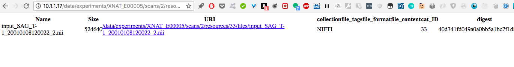
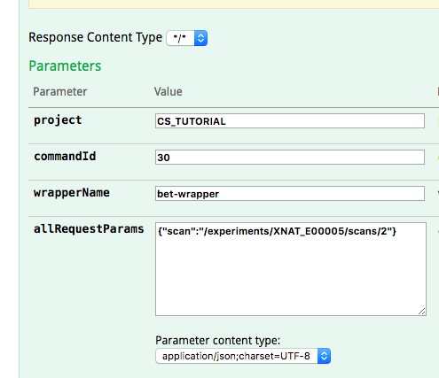
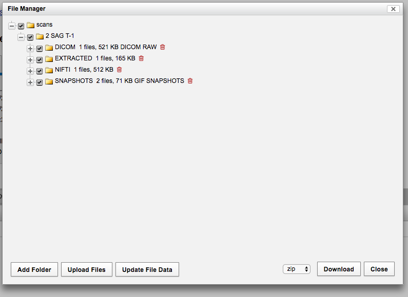

[Home](./tutorial.md)   [Glossary](./tutorial.md#glossary)

## Part 3. Accepting Arbitrary Inputs and Outputs: FSL Operations 

### Table of Contents

[A Process That Takes a File as Input](#a-process-that-takes-a-file-as-input)  
[Generating a Path to the Input](#generating-a-path-to-the-input)  
[Multiple Derived Inputs and Properties as Derived Inputs](#multiple-derived-inputs-and-properties-as-derived-inputs)  
[Putting the Command Together](#putting-the-command-together)  


### A Process That Takes a File as Input

The next step in writing commands is learning to take more kinds of input and generate more kinds of output.  To this end, we're first going to run bet, the [FSL brain extraction](https://fsl.fmrib.ox.ac.uk/fsl/fslwiki/BET/UserGuide) routine on our newly generated NIFTI file.  One of the things that makes dcm2niix a little more straightforward than bet is that with dcm2niix our input is a directory, and we don't have to think about how we would refer to files within that directory.  We have a single derived input, the resource, we mount that directly, and Bob's your uncle.  The only thing dcm2niix needs for output is also a directory.

For bet, on the other hand, the basic syntax is

`bet <input> <output> [options]`

and here `<input>` refers to the path directly to a file, and `<output>` is the name of a new file.  

The first step is to pull a new image with FSL installed.  Just like you did in [Part 1 with the dcm2niix image](./tutorial_part1.md#installing-images-for-the-container-service), install the `brainlife/fsl` image to the machine that hosts your XNAT. 

### Generating a Path to the Input

Using what we know from executing our dcm2niix command, we'll build up to generating a path to the input file within the container.  Just as before, we to need to mount the resource directory in the container.  What's new is that we need to know the path to the individual file, and that means knowing the file name.  

One option would be to look it up and manually enter it in our command line.  In Part 2 we learned to use the API to inspect data.  You coud navigate to `<your-xnat-url>/data/experiments/<your-experiment-id>/scans/2/resources/NIFTI/files` and the property name associated with your file would be, naturally enough the file name.   

Let's look it up.

 

Choosing this approach, our `command-line` entry in the command would be something like

`"command-line": "bet /input/input_SAG_T-1_20010108120022_2.nii /output/output.nii.gz [OPTIONS]"`

But we probably don't want to choose this approach. If we were 100% confident our files always had the same name it might work out alright, but otherwise, it prevents us from approaching our tasks programatically, from writing scripts that we can run for all inputs without changing variable names every time.  What we really want is a `command-line` entry that looks like:

`"bet /input/[FILENAME] /output/output.nii.gz [OPTIONS]"`

or even 

`"bet /input/[IN_FILENAME] /output/[OUT_FILENAME] [OPTIONS]"`

if we wanted to be able to supply the output filename at run time.

Then our inputs would be

```
"inputs": [
    {
      "name": "options",
      "description": "Command line flags to pass to bet",
      "type": "string",
      "matcher": null,
      "default-value": null,
      "required": false,
      "replacement-key": "[OPTIONS]",
      "command-line-flag": null,
      "command-line-separator": null,
      "true-value": null,
      "false-value": null
    },
    {
      "name": "infilename",
      "description": "input filename",
      "type": "string",
      "matcher": null,
      "default-value": null,
      "required": true,
      "replacement-key": "[IN_FILENAME]",
      "command-line-flag": null,
      "command-line-separator": null,
      "true-value": null,
      "false-value": null
    }
  ]
```

If we were planning on letting the output file name be set at run name by the program making the API query, we could also include in the input

```
 {
      "name": "outfilename",
      "description": "output filename",
      "type": "string",
      "matcher": null,
      "default-value": "output.nii.gz",
      "required": false,
      "replacement-key": "[OUT_FILENAME]",
      "command-line-flag": null,
      "command-line-separator": null,
      "true-value": null,
      "false-value": null
    }
```

in the inputs array.

We saw input replacement keys in the [first](./tutorial_part1.md#setting-up-a-first-command) and second parts of this tutorial. The only thing new is that now we are using them as part of the path to the input file name.

Where's that file name going to come from?, you might ask. Right now we're just setting up an input that can substitute for an input replacement key on the command line. It's a quirk of XNAT that only command inputs can replace an input replacement key.  Even if the information we need is going to ultimately come from a wrapper input, the wrapper input must pass that information to a command input, which can substitute for an input replacement key on the command line.  

The next task is to use wrapper inputs to derive the file name so we can pass it to the command input.

## Multiple Derived Inputs and Properties as Derived Inputs

In the dcm2niix command, we saw how to derive the resource from the scan.  To get the input file name, we have to then derive the file from the resource, and finally the file name from the file.

That looks like this:

```
 "external-inputs": [
        {
          "name": "scan",
          "description": "scan",
          "type": "Scan",
          "matcher": "'NIFTI' in @.resources[*].label",
          "default-value": null,
          "required": true,
          "replacement-key": null,
          "provides-value-for-command-input": "",
          "provides-files-for-command-mount": "",
          "via-setup-command": null,
          "user-settable": true,
          "load-children": true
        }
      ],
      "derived-inputs": [
        {
          "name": "nifti-resource",
          "description": "The nifti resource on the scan",
          "type": "Resource",
          "matcher": "@.label == 'NIFTI'",
          "default-value": null,
          "required": true,
          "replacement-key": null,
          "provides-value-for-command-input": "",
          "provides-files-for-command-mount": "nifti-in",
          "user-settable": null,
          "load-children": true,
          "derived-from-wrapper-input": "scan",
          "derived-from-xnat-object-property": null,
          "via-setup-command": null
        },
        {
          "name": "nifti-file",
          "description": "The nifti file in the resource",
          "type": "File",
          "matcher": "",
          "default-value": null,
          "required": true,
          "replacement-key": null,
          "provides-value-for-command-input": "",
          "provides-files-for-command-mount": "",
          "user-settable": null,
          "load-children": true,
          "derived-from-wrapper-input": "nifti-resource",
          "derived-from-xnat-object-property": null,
          "via-setup-command": null
        },
        {
          "name": "nifti-filename",
          "description": "The name of the nifti file on the resource",
          "type": "string",
          "matcher": "",
          "default-value": null,
          "required": true,
          "replacement-key": null,
          "provides-value-for-command-input": "infilename",
          "provides-files-for-command-mount": "",
          "user-settable": null,
          "load-children": false,
          "derived-from-wrapper-input": "nifti-file",
          "derived-from-xnat-object-property": "name",
          "via-setup-command": null
        }
      ],
```

Up through the first derived input, our command looks very similar to dcm2niix.  We still take the scan from the program making the API request as an external input.  We're still deriving the resource and mounting it at the mount point (now named "nifti-in").  What's new is that we're deriving two further inputs.  First, from the resource, we derive the file.  

You might wonder why there is no matcher for the file.  There ought to be.  It's hardly impossible for a resource to have more than one file; you might have a resource with both a NIFTI file and a text file with some metadata, for instance.  As of this writing, I have not been able to find a working matcher that doesn't assume we know the file name already -- and if we knew it, we could hard code it into the command line, which is what we hope to avoid.  Provisionally, I have been running this command with no matcher, but that's not a good long-term solution.  See [here](https://groups.google.com/forum/#!topic/xnat_discussion/uNh2CQU-LLY) for a discussion of this issue.

Finally we derive the file name.  It is the first derived input we've seen with two properties set `provides-value-for-command-input` and `derived-from-xnat-object-property`.  It provides values for the command input we created in the first section, "infilename", and it is derived from the XNAT property of the file object, name.  This input gives us our file name, which we then pass back to the command input to place on the command line.

### Putting The Command Together

Here's a whole command that can run bet:

```
{
  "name": "bet-command",
  "label": "runs bet",
  "description": "FSLBrainExtractionTool",
  "version": "1.0",
  "schema-version": "1.0",
  "info-url": "https://fsl.fmrib.ox.ac.uk/fsl/fslwiki/BET/UserGuide",
  "image": "brainlife/fsl:latest",
  "type": "docker",
  "index": "https://index.docker.io/v1/",
  "working-directory": null,
  "command-line": "bet /input/[IN_FILENAME] /output/[OUT_FILENAME] [OPTIONS]",
  "override-entrypoint": null,
  "mounts": [
    {
      "name": "in_dir",
      "writable": false,
      "path": "/input"
    },
    {
      "name": "out_dir",
      "writable": true,
      "path": "/output"
    }
  ],
  "environment-variables": {
    "envName1": "envVal1",
    "envName2": "#inputReplacementKey#"
  },
  "ports": {
    "22": "52222",
    "80": "8080"
  },
  "inputs": [
    {
      "name": "options",
      "description": "Command line flags to pass to bet",
      "type": "string",
      "matcher": null,
      "default-value": null,
      "required": false,
      "replacement-key": "[OPTIONS]",
      "command-line-flag": null,
      "command-line-separator": null,
      "true-value": null,
      "false-value": null
    },
    {
      "name": "infilename",
      "description": "input filename",
      "type": "string",
      "matcher": null,
      "default-value": null,
      "required": true,
      "replacement-key": "[IN_FILENAME]",
      "command-line-flag": null,
      "command-line-separator": null,
      "true-value": null,
      "false-value": null
    },
    {
      "name": "outfilename",
      "description": "output filename",
      "type": "string",
      "matcher": null,
      "default-value": "output.nii.gz",
      "required": false,
      "replacement-key": "[OUT_FILENAME]",
      "command-line-flag": null,
      "command-line-separator": null,
      "true-value": null,
      "false-value": null
    }
  ],
  "outputs": [
    {
      "name": "extracted-nifti",
      "description": "The nifti file with brain extracted from skull and CSF",
      "required": true,
      "mount": "out_dir",
      "path": "",
      "glob": ""
    }
  ],
  "xnat": [
    {
      "name": "bet-wrapper",
      "description": "Run FSL’s brain extraction on a nifti file.",
      "contexts": [
        "xnat:imageScanData"
      ],
      "external-inputs": [
        {
          "name": "scan",
          "description": "scan",
          "type": "Scan",
          "matcher": "'NIFTI' in @.resources[*].label",
          "default-value": null,
          "required": true,
          "replacement-key": null,
          "provides-value-for-command-input": "",
          "provides-files-for-command-mount": "",
          "via-setup-command": null,
          "user-settable": true,
          "load-children": true
        }
      ],
      "derived-inputs": [
        {
          "name": "nifti-resource",
          "description": "The nifti resource on the scan",
          "type": "Resource",
          "matcher": "@.label == 'NIFTI'",
          "default-value": null,
          "required": true,
          "replacement-key": null,
          "provides-value-for-command-input": "",
          "provides-files-for-command-mount": "in_dir",
          "user-settable": null,
          "load-children": true,
          "derived-from-wrapper-input": "scan",
          "derived-from-xnat-object-property": null,
          "via-setup-command": null
        },
        {
          "name": "nifti-file",
          "description": "The nifti file in the resource",
          "type": "File",
          "matcher": "",
          "default-value": null,
          "required": true,
          "replacement-key": null,
          "provides-value-for-command-input": "",
          "provides-files-for-command-mount": "",
          "user-settable": null,
          "load-children": true,
          "derived-from-wrapper-input": "nifti-resource",
          "derived-from-xnat-object-property": null,
          "via-setup-command": null
        },
        {
          "name": "nifti-filename",
          "description": "The name of the nifti file on the resource",
          "type": "string",
          "matcher": "",
          "default-value": null,
          "required": true,
          "replacement-key": null,
          "provides-value-for-command-input": "infilename",
          "provides-files-for-command-mount": "",
          "user-settable": null,
          "load-children": false,
          "derived-from-wrapper-input": "nifti-file",
          "derived-from-xnat-object-property": "name",
          "via-setup-command": null
        }
      ],
      "output-handlers": [
        {
          "name": "nifti-output-handler",
          "accepts-command-output": "extracted-nifti",
          "via-wrapup-command": null,
          "as-a-child-of-wrapper-input": "scan",
          "type": "Resource",
          "label": "EXTRACTED"
        }
      ]
    }
  ],
  "reserve-memory": null,
  "limit-memory": null,
  "limit-cpu": null
}

```

Add this command under the brainlife/fsl image, and just as we did before take note of the command number.  

To execute the command, you need to pass XNAT the same scan you did before.  Passing it a name for an output file is optional, since we made that input optional and gave it a default value.



Click **Try It Out**!  

You can [investigate the Command History](./tutorial_part1.md#investigating-the-command-history) to look for any output or error logs.  

If your command worked, you when you navigate to **PROJECT: CS_TUTORIAL  >  SUBJECT: dcmtest1  >  dcmtest1_MR1** and click **Manage Files** you should see a new subdirectory, extracted, that has your new NIFTI file.



You can also try navigating in your browser to the Experiment, Scan, Resource, and File pages in the API [the way we did](./tutorial_part2.md#xnats-data-organization) in Part 2 and looking for your new file there.