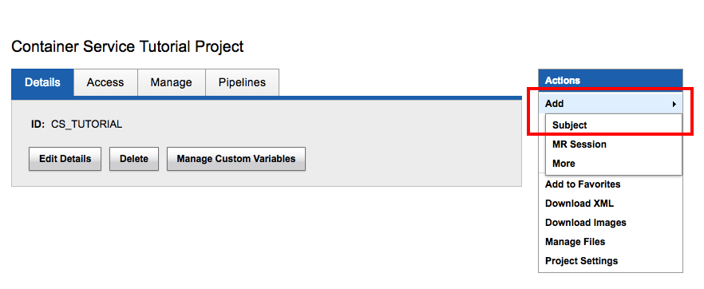
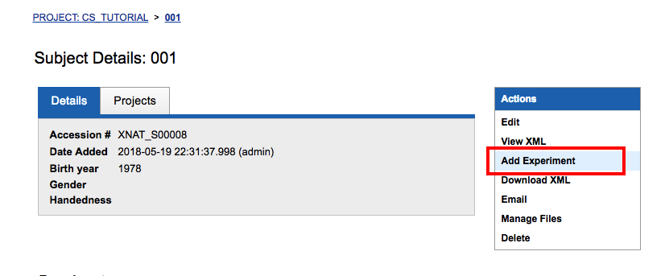
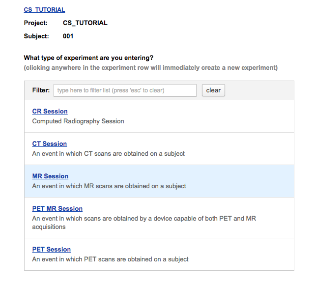
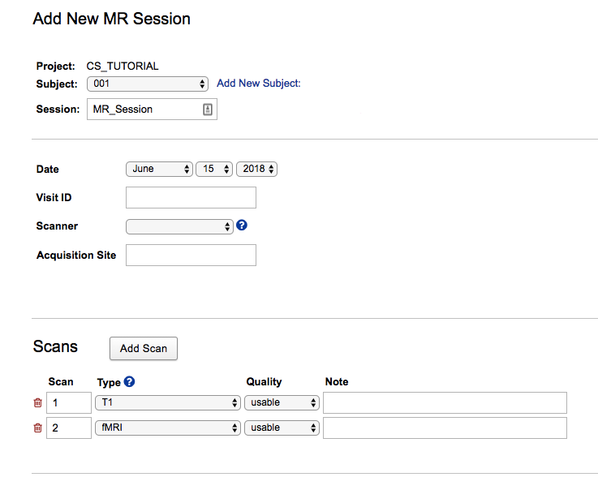
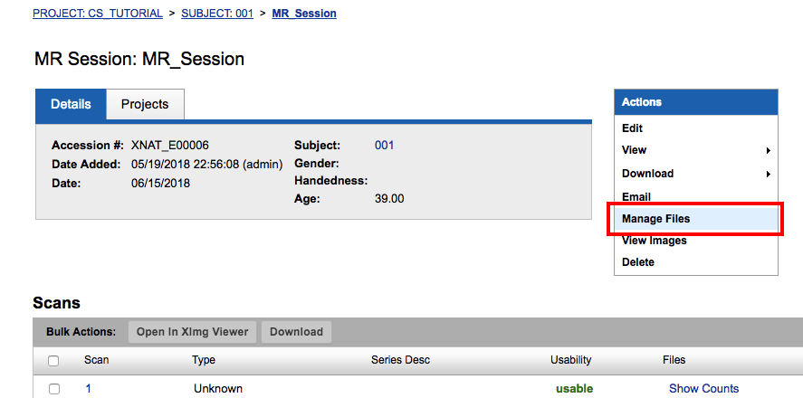
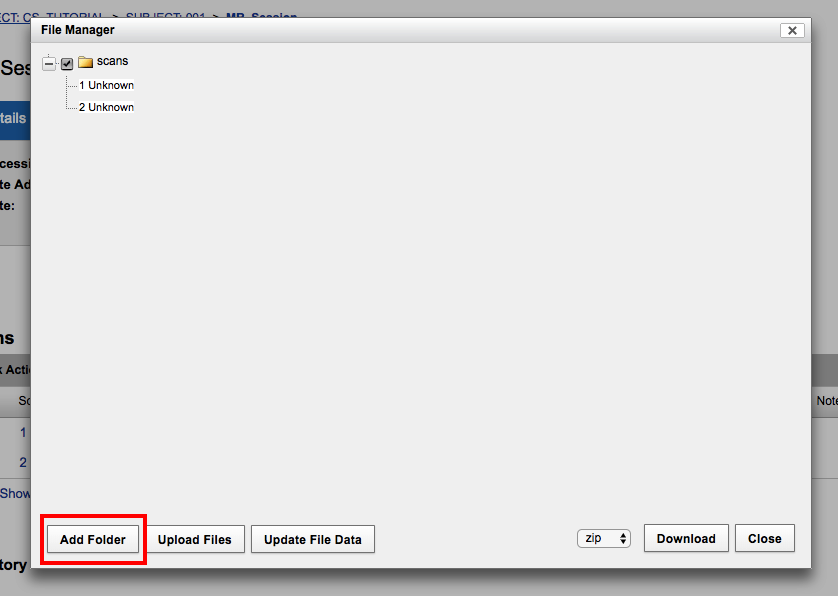
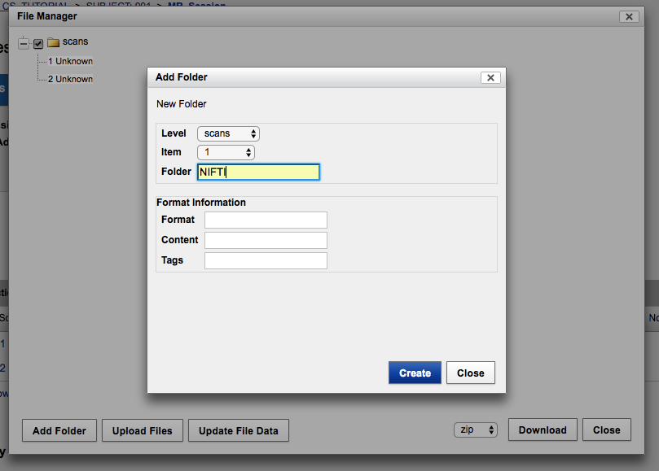
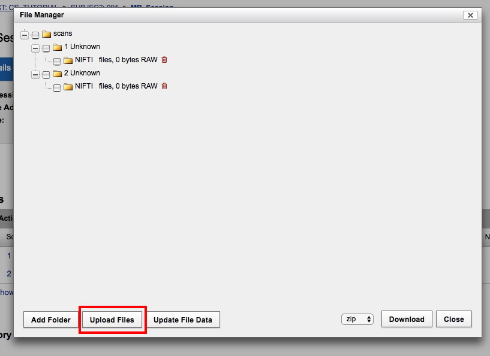
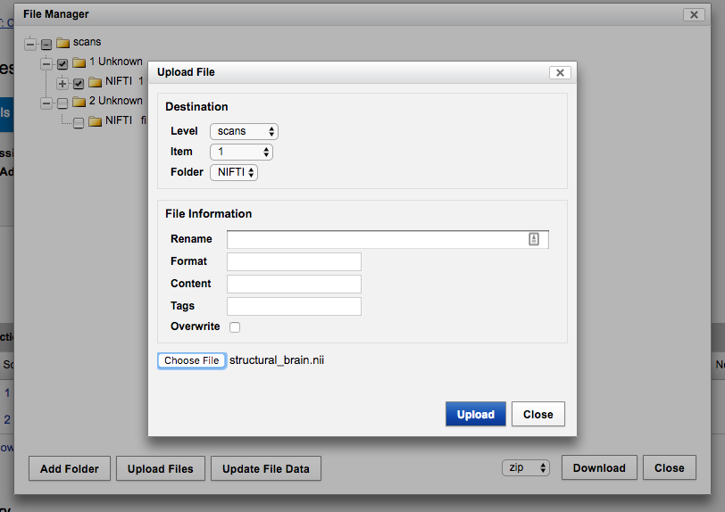

[Home](./tutorial.md)   [Glossary](./tutorial.md#glossary)

## Part 4. Accepting Arbitrary Inputs and Outputs: FSL's FLIRT

### Table of Contents 

[Multiple Inputs and Outputs](#multiple-inputs-and-outputs)  
[Getting Our Sample Data Into XNAT](#getting-our-sample-data-into-xnat)  
[The FLIRT Command Line](#the-flirt-command-line)  
[Checks for Understanding: Mounts, Wrapper Inputs and Output Handlers for FLIRT](#checks-for-understanding-mounts-wrapper-inputs-and-output-handlers-for-flirt)  
[Putting FLIRT together](#putting-flirt-together)    
[Executing the Command](#executing-the-command)  
[Goodbye for Now](#goodbye-for-now)

### Multiple Inputs and Outputs

The next step in generalizing our approach is to write commands that can take multiple inputs and generate multiple outputs, which we'll do with FSL's linear registration procedure, FLIRT.  FLIRT takes a source and a reference image as inputs, and also produces more than one output: a transformed source image and a transformation matrix.

### Getting Our Sample Data Into XNAT

To run FLIRT, we need two NIFTI files.  We can use the sample data available [here](http://www.fmrib.ox.ac.uk/primers/intro_primer/ExBox11/IntroBox11.html).  Click Data Download.  You will need to uncompress your data files.  There are multiple means of doing this; on a Mac double click should just work. First uncompress the main ExBox11 directory, and then the structural.nii.gz file and the fmri.nii.gz file.  

We need to get this data into XNAT.  Navigate to the CS_Tutorial project page and click **Add->Subject**.
I named my new subject '001', since I'm not very concerned with naming consistency with dcmtest1. 

 


Next we need to add a new experiment.  From the project page, click on Subject **001**, then click **Add Experiment**.  



The type of experiment is MR Session.  



Finally, enter the experiment information.  I named my experiment MR_Session. We have two scans in this session, our structural T1 and our functional images.  



Now we have to actually upload the imaging files to XNAT.  From the Subject page, click on the experiment, which we just named MR_Session.  Then navigate to Manage Files.



Before we upload our files we need to make the resource folder for them. Click **Add Folder**.



 Select Scans for Level, select 1 for Item, and name the folder NIFTI.  Click **Create**.
 
 
 
 Then create the same folder, also named 'NIFTI', for Scan 2. 

 Now click **Upload Files**.  

 

For the first file, level is scans, item is 1 and folder is NIFTI. Click **Choose File** and select the structural.nii file you uncompressed earlier.  Finally click **Upload**.



Now do the same thing again, this time selecting item 2 and fmri.nii.

### The FLIRT Command Line

Now that we've uploaded our files, we can write our command to register two images using FLIRT.  From the [FLIRT documentation](ftp://surfer.nmr.mgh.harvard.edu/pub/dist/freesurfer/tutorial_packages/OSX/fsl_501/doc/wiki/FLIRT(2f)UserGuide.html#FLIRT_Examples):

>The simplest usage of flirt is to register two images together as:  
>
>`flirt -in invol -ref refvol -out outvol -omat invol2refvol.mat -dof 6`  
>
>where invol, refvol, outvol are the input, reference and output volume filenames respectively, invol2refvol.mat is the filename for the saved ascii transformation matrix. Naturally, any filenames you wish to use can be chosen.

In our command, we will emulate that structure in the `command-line` entry:

 `"command-line": "flirt -in /in/[INVOL] -ref /ref/[REFVOL] -out /out/[OUTVOL] -omat /outmat/[OUTMAT] [DOF]"`

We have two inputs and two outputs.  We need a mount path for each of these outputs.  The four mounts, as you can see, are at paths `/in`, `/ref`, `/out`,  and `/outmat`, to mount the input volume, the reference volume (which is also an input, just not not in the FLIRT terminology), and our two outputs: the registered volume and the transformation matrix. 

### Command Line Inputs and Outputs

We next need to specify our command line inputs:

 ```
  "inputs": [
    {
      "name": "in_fname",
      "description": null,
      "type": "string",
      "matcher": null,
      "default-value": null,
      "required": true,
      "replacement-key": "[INVOL]",
      "command-line-flag": null,
      "command-line-separator": null,
      "true-value": null,
      "false-value": null
    },
    {
      "name": "ref_fname",
      "description": null,
      "type": "string",
      "matcher": null,
      "default-value": null,
      "required": true,
      "replacement-key": "[REFVOL]",
      "command-line-flag": null,
      "command-line-separator": null,
      "true-value": null,
      "false-value": null
    },
    {
      "name": "out_fname",
      "description": null,
      "type": "string",
      "matcher": null,
      "default-value": null,
      "required": true,
      "replacement-key": "[OUTVOL]",
      "command-line-flag": null,
      "command-line-separator": null,
      "true-value": null,
      "false-value": null
    },
    {
      "name": "mat_fname",
      "description": null,
      "type": "string",
      "matcher": null,
      "default-value": null,
      "required": true,
      "replacement-key": "[OUTMAT]",
      "command-line-flag": null,
      "command-line-separator": null,
      "true-value": null,
      "false-value": null
    },
    {
      "name": "dof",
      "description": "degrees of freedom",
      "type": "string",
      "matcher": null,
      "default-value": null,
      "required": false,
      "replacement-key": "[DOF]",
      "command-line-flag": "-dof",
      "command-line-separator": null,
      "true-value": null,
      "false-value": null
    }
  ``` 

We've made a couple of different choices here than in the bet command.  Before, we allowed the command line input that provided the name of our output to be null, i.e., we set "required" to "false", and we provided a default value so that the program in the application-program interface (us, at the Swagger UI) didn't have to provide it.  Either choice is valid; it's up to the person writing the command to decide.

Another thing you might notice is that the input "dof" has a "command-line-flag".  In command line text, a flag is a character or set of characters preceded by a hyphen that tells a computer program how to interpret what comes next. In FLIRT, the flag "-dof" precedes the number of degrees of freedom. This means when we provide the input at the Swagger UI we don't have to say "-dof 12", but instead can provide simply, "12" (or however many degrees of freedom we choose).  It also would have been valid to to leave `command-line-flag` as null, and have the input format be "-dof 12".

Next we specify the outputs.

```
 "outputs": [
    {
      "name": "outvol",
      "description": "output volume",
      "required": true,
      "mount": "out",
      "path": "./",
      "glob": ""
    },
    {
      "name": "outmat",
      "description": "transform matrix",
      "required": true,
      "mount": "outmat",
      "path": "./",
      "glob": ""
    }
  ],
```

There's something made explicit here that we left implicit when specifying outputs for bet. 
"Path" refers to the relative path from the mount directory where we want to store our files.  In this case, we want to store our files in the top level directory of the mount point. `.` refers the current working directory, the mount point.  This might become relevant if you had a process that created multiple subdirectories, and had to place your output files in one of them.

### Checks for Understanding: Mounts, Wrapper Inputs and Output Handlers for FLIRT ###

Speaking of mounts, we have four directories in our command line, in, ref, out, and outmat.  We need mount points for all of them.  As a check for understanding, try to write out how they should be defined in the command.

The external and derived inputs work just the same as they did for bet; now there are two of each type.  Now try to write out their command definition.

And finally try to write out the output handlers for our two outputs.  One subtlety here is the `as-a-child-of-wrapper-input-key`.  It will ultimately be up to you and your data needs to decide where your output go; in this case, it makes sense to store our output with our input volume (the volume that is having the transformation applied to it).

### Putting FLIRT Together ###

If you're all done checking your understanding, [here's the full command](./flirt.json) for running FLIRT.  Copy it into a new command on the Images and Commands tab.

One more check for understanding: try to write out what the parameters we will pass at the Swagger UI will be.  Hint: the JSON object we give the Swagger UI in the allRequestParams box will have five entries in it.  

Ok, are you done checking for understanding?  Then go on to the next section.

### Executing the Command

If we use this path `POST /xapi/commands/{commandId}/wrappers/{wrapperName}/launch`, we can take note of the command ID by opening it back up again ([as we did](./tutorial_part1.md/#running-our-hello-world-command) in Part 1), supply the wrapper name, `flirt-wrapper`, and the request parameters, 

```
{
"invol_scan":"/experiments/XNAT_E00006/scans/2",
"refvol_scan":"/experiments/XNAT_E00006/scans/1",
"out_fname":"transformed.nii", 
"mat_fname":"transform.txt",
"dof": "12"
}    
```

You may well have chosen different values for "out_fname" and "mat_fname".

Click **Try It Out!**. Did you get a success response? If so, [investigate the command history](./tutorial_part1.md/#investigating-the-command-history) to see if you [find any errors](./tutorial_part1.md#error-logging).  

If all went well, you should be able to see your new files in the File Manager.

  

### Goodbye For Now

That's it for this tutorial.  Later iterations may contain discussions of how to make your XNAT server communicate with remote container servers, so you can do your computing on any machine.


